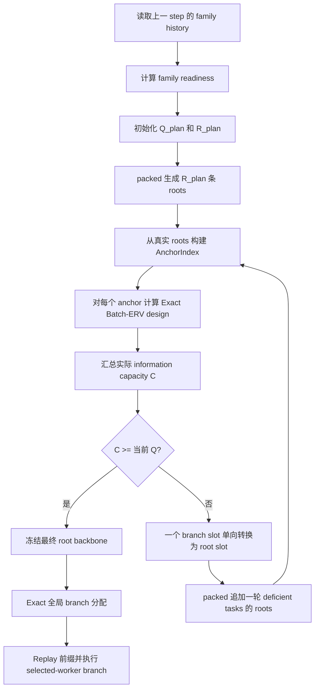

# BACE Exact Batch-ERV 容量修正与 Branch 规划偏差详细说明

日期：2026-08-26
实验：`bace_alfworld_qwen2_5_1_5b_exact_rotation_fix_seed0`
范围：正式 4×H100、step 1–150 结果的只读审计
结论性质：这是效率与规划匹配度问题，不是训练结果失效或 Batch-ERV 求解错误

## 1. 执行摘要

本次训练的每个 ALFWorld task 都有固定终端叶预算：

```text
R + Q = 8

R：natural root 数量
Q：branch 数量
```

Exact Batch-ERV 在生成当前训练 step 的 root 之前，先根据上一 step 累积的 family competence history 估计当前 task 应分配多少 branch。正式配置中最少保留 2 个 natural root，因此最多可先规划 6 个 branch：

```text
readiness = P(family competence > 0.5)
Q_plan = round((8 - 2) * readiness)
R_plan = 8 - Q_plan
```

但是，“模型具备完成该 family 的能力”并不等于“当前 task 的少量 root 中已经出现足够多、且具有足够信息价值的 branch anchor”。只有 root 真正生成后，系统才能知道：

1. 实际出现了哪些可恢复的 anchor；
2. 每个 anchor 上有哪些不同 action；
3. 各 action 的局部 Beta posterior；
4. 继续采样 1 或 2 个 branch 的 Exact Batch-ERV 是否超过阈值 `0.005`；
5. 当前 task 的总 information capacity 是否足以承载 `Q_plan`。

如果真实 capacity 小于规划的 branch 数，系统会执行单向修正：

```text
R <- R + 1
Q <- Q - 1
```

然后为该 task 再生成一条 root，重新构建 anchor 和计算 capacity。一次检查最多只转换一个 slot，因此一个最初规划 `R=2, Q=6` 的 task 最多需要 6 轮追加检查。

150 step 的实际统计为：

| 指标 | 结果 |
|---|---:|
| task 实例总数 | 2,400 |
| 初始规划 branch | 7,116 |
| 最终执行 branch | 5,703 |
| branch→root 容量修正 | 1,413 |
| 修正占初始规划 branch | 19.86% |
| 至少修正一次的 task | 361（15.04%） |
| 至少出现一次修正的训练 step | 77/150 |
| 修正 root 追加 wave | 376 |
| 修正阶段 root 生成时间 | 8,534.4 秒（2.37 小时） |
| 总训练 step 时间 | 62,264.4 秒（17.30 小时） |
| 修正阶段时间占总 step 时间 | 13.71% |

核心判断：

- **正确性正常**：最终始终满足 `R+Q=8`，没有执行超过真实 capacity 的 branch。
- **Exact 全局求解器没有算错**：偏差发生在进入全局分配之前，是 lagged family quota 与本批实际 anchor capacity 不一致。
- **修正 root 不是废弃样本**：它们成为最终 natural roots 并进入 PPO；本次 `discarded_roots_mean=0`。
- **主要效率损失来自追加 wave**：如果初始规划能更接近最终 topology，这些 root 可以更早进入较大的 packed wave，而不需要最多 6 轮追加生成。
- **Replay 不是主要瓶颈**：branch 前缀恢复与验证总计约 0.59 小时，显著低于修正 root 的 2.37 小时和 branch suffix 的 6.06 小时。

## 2. 当前算法的实际时序



这里有两个不同层次的决策，不能混为一谈：

### 2.1 Family readiness 决定“想要多少 branch”

代码位置：

- `recipe/bace_gigpo/topology.py:305-324`

`ExactBatchTopologyPlanner.initialize()` 在当前 root 尚未生成时，只读取 lagged family posterior。readiness 越高，初始 branch quota 越大。

该设计有明确目的：避免直接使用当前 batch 的 root outcome 决定初始 topology，保持 no-pilot、lagged-family 的主方法语义。

### 2.2 Exact information capacity 决定“实际上能执行多少 branch”

代码位置：

- `recipe/bace_gigpo/topology.py:326-377`

root 生成后，系统为真实 anchor 构建 Batch-ERV design。一个 anchor 能够贡献的 capacity 是：其第 1 个、第 2 个 branch 的边际 ERV 中，有多少个仍超过阈值。所有 anchor capacity 之和才是该 task 当前能够支持的 branch 上限。

因此 capacity 可能因为以下原因偏小：

- 少量 root 走出了高度相似的前缀，可用 anchor 多样性有限；
- 某个 anchor 虽然存在，但没有形成有意义的 action 对比；
- action outcome 已经较确定，继续采样的边际 ERV 低于 `0.005`；
- family competence 很高，但当前 task 的局部 action uncertainty 很低；
- `max_branches_per_anchor=2` 限制了单个 anchor 的最大贡献。

### 2.3 容量修正是安全机制

代码位置：

- `recipe/bace_gigpo/topology.py:358-377`
- `recipe/bace_gigpo/rollout_collector.py:1048-1158`

当 `information_capacity < branch_count` 时，当前实现每轮只做一次 `Q-1, R+1`，随后追加 root 并重新计算。这个过程保证：

- 最终 branch quota 不超过可执行 capacity；
- 每个 task 的终端叶预算始终为 8；
- 已生成的 root 不被丢弃；
- branch plan、Replay 和 PPO occurrence 语义保持一致。

所以不能直接删除 capacity correction。若删除，Coordinator 可能得到没有合法 ERV request 支撑的 branch quota，最终要么违反 Exact 语义，要么在执行阶段失败。

## 3. 为什么 family competence 高仍然会容量不足

这是当前现象最容易被误解的地方。

readiness 和 information capacity 衡量的不是同一件事：

| 量 | 回答的问题 | 数据来源 |
|---|---|---|
| family readiness | 模型是否大概率具备完成这一类任务的能力？ | 以前 step 的 family root 成败 history |
| local ERV | 在这个具体 anchor 上再观察 branch outcome，能减少多少 action credit 不确定性？ | 当前 task 已生成 roots 的 anchor/action/outcome |
| information capacity | 当前 task 有多少个边际 ERV 超过阈值的合法 branch slot？ | 当前所有 anchor 的 Exact Batch-ERV design |

因此以下情况完全可能发生：

```text
family 很擅长 -> readiness 接近 1 -> 初始 Q_plan=6

但当前两条 root：
  - 轨迹相似；或
  - action posterior 已经很确定；或
  - 可区分 action 的边际 ERV 小于 0.005

于是实际 capacity < 6，甚至为 0。
```

换句话说，当前公式将 competence readiness 同时当作“允许 branching 的门”和“branch 数量需求”。前者合理；后者与局部信息价值并不总是单调一致。这是规划偏差的根本来源。

## 4. 按 family 的实际结果

| Family | task 数 | 规划 branch | 最终 branch | 修正数 | 修正率 | 被修正 task | 平均结构 anchor | 最终平均 information capacity |
|---|---:|---:|---:|---:|---:|---:|---:|---:|
| look-at-object-in-light | 217 | 611 | 577 | 34 | 5.56% | 10 | 12.28 | 20.10 |
| pick-and-place | 534 | 2,372 | 1,518 | 854 | **36.00%** | 192 | 9.73 | 13.60 |
| clean-then-place | 415 | 1,302 | 1,076 | 226 | 17.36% | 68 | 14.69 | 21.23 |
| cool-then-place | 350 | 929 | 807 | 122 | 13.13% | 37 | 17.77 | 23.52 |
| heat-then-place | 338 | 967 | 808 | 159 | 16.44% | 48 | 18.76 | 24.76 |
| pick-two-and-place | 546 | 935 | 917 | 18 | **1.93%** | 6 | 22.11 | 20.42 |

### 4.1 pick-and-place 为什么最突出

pick-and-place 共 534 个 task，其中 254 个被初始规划为最大 quota `Q=6`。在这些 task 中：

- 97 个从 `Q=6` 一直修正为 `Q=0`；
- 仅这 97 个 task 就贡献了 582 次修正；
- pick-and-place 总计贡献 854/1,413，即全部修正的 60.44%。

这说明后期 pick-and-place family posterior 经常给出很高 readiness，但具体 task 的最初少量 root 没有稳定提供相匹配的局部信息容量。

需要注意，表中的“最终平均 information capacity”不能反推最初 capacity 足够。新 root 本身会创造新的 anchor，最终 capacity 可能高于第一次检查时的 capacity；而修正是单向的，已经生成的 root 不会再转换回 branch。这样做保证不丢弃 rollout，但也会形成保守性。

### 4.2 pick-two 为什么修正很少

pick-two 的 546 个 task 中有 270 个初始 `Q=0`，没有出现 `Q=6` 的 task；同时其最终结构 anchor 数较多。因此它既较少提出激进 branch quota，也更容易支持已经提出的 quota，最终修正率只有 1.93%。

这进一步说明问题不是统一的 GPU、Replay 或求解器故障，而是 family readiness 分布与各 family 局部 anchor 结构之间的匹配差异。

## 5. 问题为什么集中在训练后期

| 训练阶段 | 规划 branch | 最终 branch | 修正数 | 修正率 | 有修正的 step | 每 step 平均修正 |
|---|---:|---:|---:|---:|---:|---:|
| step 1–25 | 117 | 117 | 0 | 0.00% | 0/25 | 0.00 |
| step 26–50 | 432 | 432 | 0 | 0.00% | 0/25 | 0.00 |
| step 51–75 | 742 | 713 | 29 | 3.91% | 8/25 | 1.16 |
| step 76–100 | 1,578 | 1,463 | 115 | 7.29% | 19/25 | 4.60 |
| step 101–125 | 2,037 | 1,536 | 501 | 24.60% | 25/25 | 20.04 |
| step 126–150 | 2,210 | 1,442 | 768 | **34.75%** | 25/25 | 30.72 |

训练后期 family competence 提高，readiness 也提高，于是 `Q_plan` 越来越接近 6，初始只生成 2–3 条 root。实际 anchor capacity 却不一定按相同速度增长，因此偏差集中暴露在 step 100 以后。

这也解释了训练吞吐下降：

- step 1–50：总 step 时间 4.30 小时，容量修正时间为 0；
- step 51–100：总 step 时间 5.58 小时，容量修正时间 0.36 小时；
- step 101–150：总 step 时间 7.42 小时，容量修正时间 2.01 小时。

## 6. 最严重 step 示例

修正最多的是 step 136：

| 项目 | 数值 |
|---|---:|
| task 数 | 16 |
| 初始规划 branch | 96 |
| 最终 branch | 47 |
| branch→root 修正 | 49 |
| 被修正 task | 12 |
| 追加修正 wave | 6 |
| 初始 planned root 生成 | 84.74 秒 |
| capacity-correction root 生成 | **329.09 秒** |
| branch suffix 生成 | 181.96 秒 |
| Replay 验证 | 19.72 秒 |
| 总 step 时间 | 657.89 秒 |

step 136 的 family 分解：

| Family | task 数 | 规划 branch | 最终 branch | 修正数 |
|---|---:|---:|---:|---:|
| pick-and-place | 4 | 24 | 12 | 12 |
| clean-then-place | 4 | 24 | 6 | 18 |
| cool-then-place | 5 | 30 | 17 | 13 |
| heat-then-place | 2 | 12 | 6 | 6 |
| look-at-object-in-light | 1 | 6 | 6 | 0 |

这一 step 清楚展示了瓶颈：Replay 只有约 20 秒，真正拖慢 step 的是 6 轮追加 root，其中还包含不同 task rollout 长度造成的 wave straggler。

## 7. 2.37 小时究竟是不是“浪费”

不能把 2.37 小时全部称为无效计算。

### 7.1 有效部分

1,413 条修正 root 全部成为最终 topology 的 natural roots：

- 它们提供 PPO 训练 occurrence；
- 它们提供 family history 的 natural-root outcome；
- 它们可能创造新的 anchor；
- 没有 root 被生成后丢弃。

如果最终 topology 本来就需要这些 roots，那么 root rollout 本身是训练数据成本，不是纯浪费。

### 7.2 可优化部分

可优化的是“发现这些 root 有必要”的时间太晚：

- 初始规划将许多 slot 预留为 branch；
- 第一批只生成 2–3 条 root；
- capacity 不够后，每轮每个 deficient task 只增加 1 条 root；
- 单 task 的决策必须等待上一条 root 完成并重新计算；
- 因此最多产生 6 个串行 correction waves。

如果 lagged planner 能更准确地预测最终需要的 root 数，一部分 root 可以在初始 planned wave 中一起生成，减少 wave 启动、同步和长轨迹 straggler。

所以 2.37 小时应理解为：

> 当前追加修正阶段的总 wall time，也是通过更准确规划和更好的执行调度可以争取降低的上界；它不是 2.37 小时无用数据。

## 8. 与 Replay、compaction 和 Exact 全局分配的关系

### 8.1 与 Replay 无关

capacity correction 发生在 branch request 产生之前。它追加的是 natural root，不执行 branch prefix replay。

本次统计：

| 阶段 | 总耗时 |
|---|---:|
| 初始 planned roots | 4.27 小时 |
| capacity-correction roots | 2.37 小时 |
| branch validation replay | 0.59 小时 |
| branch suffix generation | 6.06 小时 |

因此不能通过删除 Replay 来解决容量修正问题。Replay 已经不是主要时间来源。

### 8.2 与 selected-worker/active compaction 无冲突

selected-worker 和 active compaction 解决的是 branch 已确定后的执行浪费；capacity correction 解决的是 branch 确定前的可行性。两者位于 pipeline 的不同阶段。

本次 branch suffix 的 active/dense 比约为 37.5%，即 compaction 避免了约 62.5% 的 dense inactive 执行。这部分修复已经生效，不应回退。

### 8.3 不是 Exact 全局分配器的问题

全局 Exact 分配发生在每个 task 的真实 capacity 已经收敛之后。它只能在合法 anchor capacity 内分配最终 `Q`，不能为一个没有局部信息容量的 task 凭空创造 branch。

因此应保留现有：

- Exact 全局分配；
- packed roots；
- branch plan；
- selected-worker branch execution；
- occurrence-level PPO credit；
- strict identity；
- Replay 验证。

## 9. 可选改进方案

改进需要区分“完全不改变算法语义”和“改变初始 topology 策略”。

### 9.1 第一优先级：补充诊断指标，不改变语义

建议记录：

- 每个 task 第一次 capacity check 的 `initial_information_capacity`；
- 每轮 `(R, Q, structural_anchor_count, information_capacity)`；
- capacity 为零的原因分类：无结构 anchor、无有效 action 对比、ERV 低于阈值；
- 按 family 的 planned/final/correction 数；
- 按 family 的 correction root 秒数和 wave straggler；
- `capacity_gain_per_added_root`；
- 最终存在闲置 capacity、但因单向修正无法恢复 branch 的 task 数。

这一步风险最低，可以准确区分：

1. 初始 root 太少；
2. anchor 结构不足；
3. posterior 已确定、ERV 太低；
4. 单向修正造成的保守性。

### 9.2 第二优先级：优化 correction wave 执行，不改变最终约束

在保持“一条新 root 后重新评估”的 Exact 时序时，可以优化：

- 让所有 deficient task 的下一条 root 继续使用 packed active batch；
- 改善 root wave 的长度分桶，降低长轨迹 straggler；
- 减少 correction wave 间的环境 reset、batch concat 和调度开销；
- 对已经结束的 root worker 做 active compaction，而不是等待 dense wave；
- 单独记录纯模型生成时间和 Python/环境同步时间。

当前实现已经跨 task packed，但同一 task 的 Exact 决策仍天然串行。这类优化不能完全消除 6 轮依赖，却可能降低每轮成本。

### 9.3 推荐的算法改进：lagged capacity-aware quota

在不读取当前 task outcome 的前提下，利用以前 step 的 capacity 统计，为每个 family 建立保守容量预测：

```text
C_hat = lagged_capacity_model(
    family,
    readiness,
    initial_root_count,
    history_strength
)

Q_plan = min(
    round(6 * readiness),
    conservative_quantile(C_hat)
)
R_plan = 8 - Q_plan
```

然后继续保留当前 Exact capacity correction 作为最终安全网。

优点：

- 不读取当前 batch outcome，保留 lagged/no-pilot 原则；
- 可以针对 pick-and-place 自动降低过于乐观的初始 quota；
- 不取消 Exact feasibility check；
- 有机会把最终必需的 roots 提前放进初始 packed wave。

风险：

- 会改变 BACE 初始 topology policy，需要作为算法变更重新测试；
- 历史容量具有 task 分布依赖，预测过于保守会少做有价值的 branch；
- 需要防止容量预测与训练数据选择形成未经分析的反馈回路。

建议先离线 replay 150-step trace，比较不同 predictor 在不实际重新训练时能够预测多少最终 `Q`，再决定是否实装。

### 9.4 简单但语义更强的方案：提高最少 natural roots

将 `R_min=2` 提高到 3 或 4，会直接减少初始最大 branch quota和 correction 深度。

优点是实现简单；缺点是无论实际 capacity 是否充足都会减少 branch，明显改变原实验方法参数。因此不建议仅为提速直接修改正式主配置。

### 9.5 谨慎方案：一次转换多个 slot

当 `C << Q` 时，一次把多个 branch slot 转换为 roots，可以减少 correction waves。例如按 deficit 转换：

```text
k = Q - C
R <- R + k
Q <- Q - k
```

但新 root 可能马上创造足够 capacity。如果一次转换过多，已经生成的 root 不能再无损恢复成 branch，会比当前逐条检查更保守，并改变最终 topology。因此该方案不保持当前 Exact 时序，不应作为首选。

### 9.6 不建议的“优化”

以下做法虽然可能减少报表中的 correction，但会损害方法语义或正确性：

- 删除 capacity correction；
- 不验证 capacity，强制执行全部 `Q_plan`；
- 为提速直接降低 Batch-ERV threshold；
- 将无法执行的 branch 静默丢弃，使 `R+Q<8`；
- 把 correction root 排除在 PPO 或 family history 之外；
- 用 branch outcome 更新 family competence history；
- 回退 selected-worker 或恢复 double replay。

## 10. 建议的验证与验收标准

若后续修改容量规划或执行调度，应至少满足：

### 10.1 正确性门禁

- 每个 task 最终 `R+Q=8`；
- `Q <= final_information_capacity`；
- `discarded_roots=0`，除非明确引入并审计新的 speculative 模式；
- requested branch 全部 validated，或有明确失败终止记录；
- branch plan 与 executed occurrence 一一对应；
- branch outcome 不进入 family history；
- Exact、packed、selected-worker 标志均为 1；
- Replay mechanical steps、origin transition 和 suffix steps 守恒；
- trace validation 通过。

### 10.2 效率指标

在同一模型、seed、任务 batch 和硬件上比较：

- correction/planned branch 比例；
- correction root waves；
- correction root generation seconds；
- p50/p95/p99 step time；
- root/suffix/replay 分项耗时；
- GPU utilization 和 active padding；
- 每个 family 的 under-plan/over-plan 情况。

可把以下目标作为工程优化参考，而不是算法硬约束：

```text
总体 correction ratio：19.9% -> <10%
correction wall-time 占比：13.7% -> <5%
```

前提是 validation、branch 信息价值和训练最终表现不下降。

### 10.3 推荐测试顺序

1. 使用现有 150-step trace 离线评估 capacity predictor；
2. 新增 topology/capacity 单测；
3. 单卡强制 branch smoke；
4. 4 卡 3-step 稳定性作业；
5. 固定任务 batch 的 20-step A/B profile；
6. 确认效率和 validation 均无回退后再跑完整实验。

## 11. 最终判断

当前 capacity correction 的存在是合理且必要的。它成功避免了“规划 branch 超过真实 anchor capacity”这一正确性问题，并保证了全部 150 step 的预算、Replay 和 PPO 数据语义成立。

真正值得改进的不是删除修正，而是缩小以下差距：

```text
lagged family readiness 给出的 branch 需求
                    vs.
当前 task roots 实际产生的 Exact information capacity
```

本次差距主要出现在训练后半程，并高度集中于 pick-and-place。最稳妥的路线是：先补齐首次 capacity、修正原因和 per-family 时间指标，再离线验证 lagged capacity-aware quota；在此之前保留当前逐步 correction 作为安全网。

## 12. 数据与代码来源

实验数据：

- `experiments/alfworld-qwen2.5-1.5b-exact/bace_artifacts/bace_alfworld_qwen2_5_1_5b_exact_rotation_fix_seed0/step_*/family_topology_plans.jsonl`
- `experiments/alfworld-qwen2.5-1.5b-exact/bace_artifacts/bace_alfworld_qwen2_5_1_5b_exact_rotation_fix_seed0/step_*/capacity_checks.jsonl`
- `experiments/alfworld-qwen2.5-1.5b-exact/analysis/training_curves_1_150/all_training_scalars_1_150.csv`

主要代码：

- `verl-agent-src/recipe/bace_gigpo/topology.py`
- `verl-agent-src/recipe/bace_gigpo/rollout_collector.py`
- `verl-agent-src/recipe/bace_gigpo/coordinator.py`
- `verl-agent-src/recipe/bace_gigpo/batch_erv.py`

统计口径：读取正式 run 的 step 1–150，每个 step 使用 `capacity_checks.jsonl` 的最终记录；验证 `correction_count = planned_branch_count - final_branch_count` 后再按 step 和 family 聚合。时间统计来自 TensorBoard scalar 汇总 CSV。
