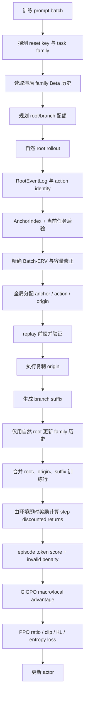

# BACE 方法的完整代码流程说明

本文严格对应当前仓库 `verl-agent-src` 的实现，重点说明当前实际运行的
`algorithm.bace.variant=batch_erv_exact` 路径，而不是只按论文描述 BACE。
主配置是
`examples/gigpo_trainer/run_bace_alfworld_gpu.sh`。下表是未额外设置环境变量、也未在
命令行追加 Hydra override 时的默认值：

| 配置 | 当前值 | 代码含义 |
|---|---:|---|
| `algorithm.adv_estimator` | `bace_gigpo` | 使用 BACE 的 GiGPO 优势实现 |
| `bace.variant` | `batch_erv_exact` | 精确 Beta-Binomial Batch-ERV |
| `topology` | `dynamic` | 每个任务动态决定 root/branch 数量 |
| `dynamic_root_generation` | `staged` | 先按滞后 family 历史规划，再生成 root |
| `staged_root_batching` | `packed` | 按波次批量生成 root |
| `acquisition` | `batch_erv_exact` | 一次求解整批 branch 分配 |
| `total_leaf_budget` | $8$ | 每个任务最终 root+branch 必须等于 $8$ |
| `min_natural_roots` | $2$ | exact 路径至少保留 $2$ 条自然 root |
| `max_branches_per_anchor` | $2$ | 一个 anchor 最多承载 $2$ 条 branch |
| `batch_erv_threshold` | $0.01$ | 边际 Batch-ERV 低于此值时不扩充容量 |
| `history_base_alpha/beta` | $1/1$ | family 能力历史的基础先验 |
| `history_forgetting` | $0.9$ | family 成功/失败计数的衰减系数 |
| `history_transfer_fraction` | $0.1$ | family 原始证据转成可用先验强度的比例 |
| `history_min/max_strength` | $2/8$ | family 先验强度截断范围 |
| `local_prior_strength` | $2$ | anchor 内动作后验的局部先验强度 |
| `invalid_action_mode` | `strict_identity` | 环境无效但格式有效的动作按不同 identity 保留 |
| `local_credit_mode` | `occurrence` | 局部优势按 occurrence，而不是动作均值 |
| `gigpo.mode` | `mean_std_norm` | 均值减法后除以样本标准差 |
| `compute_mean_std_cross_steps` | `true` | 统计量使用所有物理 occurrence |
| `gigpo.step_advantage_w` | $1$ | macro 与 local 优势等权 |
| `gamma` | $0.95$ | occurrence 间折扣回报 |
| invalid penalty | $0.1$ | 只按格式无效标记扣除 |
| reward KL | 关闭 | `token_level_rewards = token_level_scores` |
| actor KL loss | 开启，系数 $0.01$ | PPO policy loss 的额外参考策略 KL |
| actor entropy | 系数 $0.001$ | PPO policy loss 的熵奖励 |
| clip | $0.2$，dual clip $3$ | 当前 PPO policy loss |

入口在 `verl/trainer/main_ppo.py:140-195`。启用 BACE 后，主训练器创建
`BaceTrajectoryCollector`，并要求 `env.rollout.n` 等于 dynamic 的
`total_leaf_budget`；当前脚本中的 `group_size=8` 因而与叶子预算一致。

---

## 1. 数据对象和术语

一次 PPO 更新包含若干任务，每个任务由一个 `uid` 标识。每个任务还会
生成多条叶子轨迹：

- **自然 root**：从环境初始状态完整生成的普通轨迹；其 terminal reward 用来更新
  family 历史、当前任务后验和 anchor 内的自然证据。
- **event/occurrence**：一条轨迹中的一个动作发生。代码记录
  `step_index`、动作前观察 `anchor_obs`、原始模型回复、投影动作、动作 identity、
  post-state、立即 reward、done 和剩余 horizon。
- **structural anchor**：同一任务、同一个精确动作前观察下，至少有两次 occurrence，且至少有两种统计动作 identity；step 0 不参与 structural anchor。
- **branch**：从某个自然 occurrence 的前缀 replay 到 anchor，复制该 occurrence 的
  原始回复，再由模型生成后缀。
- **terminal leaf**：root 或 branch；最终每个任务满足
  $\mathtt{root\_count}+\mathtt{branch\_count}=\mathtt{total\_leaf\_budget}$。

root 的不可变事件日志由 `recipe/bace_gigpo/root_store.py:49-145` 构造。
日志按 trajectory 排序，并把同一 root 的 `episode_rewards` 转成
$\mathtt{won}=(\mathtt{terminal\_reward}>0)$。

---

## 2. 一次 PPO 更新的总流程

当前 exact/packed 路径的实现入口是
`recipe/bace_gigpo/rollout_collector.py:1292-1547`。frontier 和 legacy
sequential ERV 仍在仓库中，但不是当前配置所走的路径。

---

## 3. Family 能力分布、readiness 和 root/branch 配额

### 3.1 长期 family 历史

`recipe/bace_gigpo/competence.py:39-105` 为每个 task family 保存衰减后的成功、失败计数：

$$
 S_h \leftarrow f S_h + s_h,\qquad
 F_h \leftarrow f F_h + f_h,
$$

其中 $f=0.9$，$s_h/f_h$ 只来自本次 PPO 更新中被选定的自然 root，branch
明确不进入 family 历史。

原始证据为

$$
 \alpha_{raw}=\alpha_0+S_h,\qquad
 \beta_{raw}=\beta_0+F_h,
$$

其均值与可转移强度为

$$
 m_h=\frac{\alpha_{raw}}{\alpha_{raw}+\beta_{raw}},\qquad
 \kappa_h=\operatorname{clip}\left(c(\alpha_{raw}+\beta_{raw}),2,8\right).
$$

真正交给当前任务的 family prior 是
$\operatorname{Beta}(m_h\kappa_h,(1-m_h)\kappa_h)$。初始无历史时
$\operatorname{Beta}(1,1)$ 经强度下限仍为
$\operatorname{Beta}(0.5\times2,0.5\times2)=\operatorname{Beta}(1,1)$。

### 3.2 当前 exact 路径的 readiness

`ExactBatchTopologyPlanner.initialize()` 位于
`recipe/bace_gigpo/topology.py:299-318`。它只读取滞后的 family prior，
不读取当前批次尚未生成的 root 结果：

$$
 \rho_h=P(\theta_h>\tau)
   =1-I_{\tau}(\alpha_h,\beta_h),
$$

其中 $\tau=\mathtt{competence\_threshold}=0.5$，$I$ 是 Beta CDF。

设每个任务叶子预算为 $B$，至少 $R_{min}$ 条自然 root，则可灵活分配的预算为
$B-R_{min}$，计划 branch 数量为代码中的 half-up 舍入：

$$
 Q_{plan}=\operatorname{clip}\left(
 \left\lfloor(B-R_{min})\rho_h+0.5\right\rfloor,
 0,B-R_{min}\right).
$$

初始计划是 $\mathtt{root\_count}=B-Q_{plan}$、
$\mathtt{branch\_count}=Q_{plan}$。因此 exact 变体
没有旧实现中的 pilot root 阶段；root 的初始数量已经由滞后 family 历史决定。

### 3.3 packed 自然 root rollout

`rollout_collector.py:820-930` 的实际顺序是：

1. 每个任务先探测一个稳定的环境 reset key/game file，并从 reset key 解析 family。
2. 根据 family 历史为每个任务初始化 `ExactBatchTaskState`。
3. 按 slot-major 波次生成每个任务当前所需的 planned roots；每条 root 使用标准
   `vanilla_multi_turn_loop()`。
4. 将 rollout 行转换为 `RootEventLog`，构建 anchor 和 exact design，计算信息容量。
5. 若 $\mathtt{information\_capacity}<\mathtt{branch\_count}$，把一个 branch slot 改成 root slot，
   每轮每个 deficient task 最多增加一个 root，然后重新生成并评估。
6. 直到容量足够，最终固定
   $\mathtt{root\_count}+\mathtt{branch\_count}=B$。

容量修正不是重新放大总预算，而是在 root 与 branch 之间重新分配同一个预算。
通用指标仍会计算
$\mathtt{discarded\_roots\_mean}=\mathtt{generated\_roots}-\mathtt{final\_roots}$；当前 exact/packed
路径按最终需要逐条补 root，生成的 root 全部进入最终 plan，所以正常情况下该值为 0。

---

## 4. 自然 rollout、动作身份和 root 证据

标准多轮循环在 `agent_system/multi_turn_rollout/rollout_loop.py:313-477`：

1. reset 环境，取得文本观察、可执行动作集合和 task 信息。
2. 每个 active occurrence 构造 prompt，调用 actor rollout 生成回复。
3. ALFWorld projection 解析 `<think>...</think>` 与 `<action>...</action>`，再把动作
   投影给环境。
4. 环境返回 next observation、立即 reward、done 和 validity 信息；只要环境仍 active，
   该 occurrence 就保留在训练候选中。
5. 每条 trajectory 结束后，将 terminal `episode_rewards` 和 `episode_lengths` 复制到
   该 trajectory 的每个有效 occurrence (`gather_rollout_data()`，
   `rollout_loop.py:237-287`)。

ALFWorld 文本环境的即时 reward 是

$$
 r_t=10\times\texttt{won}_t,
$$

见 `agent_system/environments/env_package/alfworld/envs.py:49-54`。通常失败轨迹
episode reward 为 0，成功终点贡献 10。

### 4.1 三种有效性概念

ALFWorld manager (`agent_system/environments/env_manager.py:353-388`) 分别记录：

- `is_action_format_valid`：回复格式是否满足 parser 要求；
- `is_action_environment_valid`：格式有效且投影动作在当前 admissible action set 中；
- `is_action_valid`：当前训练中用于 invalid penalty 的字段，取的是 **format validity**。

因此，格式正确但环境不可执行的动作不会触发 0.1 penalty；它可以在
`strict_identity` 下作为独立统计动作参与 anchor/ERV。

动作 identity 由 `alfworld/projection.py:35-42` 定义：

- 格式无效：`None`；
- 格式有效且环境可执行：`valid::<projected_action>`；
- 格式有效但环境不可执行：`invalid::<raw_action_body>`。

`strict_identity` 保留每个 `invalid::<body>` 的区别；`valid_only_branch` 会排除
环境无效动作，`single_invalid_bucket` 会合并成一个无效桶。

---

## 5. Anchor 与局部动作 Beta 后验

### 5.1 Structural anchor

`recipe/bace_gigpo/anchor_index.py:44-81` 只用冻结的自然 root：

1. 按 `(task_id, exact pre_action_observation)` 分组；
2. 排除 `step_index == 0`；
3. 排除格式无效、没有统计 identity 的 occurrence；
4. 要求 occurrence 数至少 2，且 distinct action identity 至少 2；
5. 为每个 action 保存所有匹配的自然 origin occurrence。

相同 root 内重复到达同一个 observation/action 也按 occurrence 计数；代码没有按
root 去重。

### 5.2 当前任务 posterior

自然 root 成功数为 $S_{root}$，失败数为 $F_{root}$。对 exact topology，当前任务能力后验是

$$
 \alpha_{cur}=\alpha_h+S_{root},\qquad
 \beta_{cur}=\beta_h+F_{root},qquad
 m_{cur}=\frac{\alpha_{cur}}{\alpha_{cur}+\beta_{cur}}.
$$

每个 anchor 的动作 $a$ 使用局部先验强度 $\lambda=2$，并把该动作所有自然
 occurrence 对应的 root `won` 作为证据：

$$
 \alpha_a=\lambda m_{cur}+S_a,\qquad
 \beta_a=\lambda(1-m_{cur})+F_a.
$$

这是 `recipe/bace_gigpo/posterior.py:95-111` 的
`initialize_local_posterior()`。$S_a/F_a$ 是动作 occurrence 数对应的 root outcome，
不是不同 root 的集合数。

---

## 6. Exact Batch-ERV：ERV、容量和 anchor 选择

### 6.1 一个 batch plan 的精确价值

对同一 anchor，令 $q$ 是动作 multiset，$n_a$ 是动作 $a$ 被安排的 branch 数，
当前最好后验均值为

$$
 M_0=\max_a \frac{\alpha_a}{\alpha_a+\beta_a}.
$$

若对动作 $a$ 采样 $n_a$ 条 branch，成功数 $K_a$ 服从 Beta-Binomial：

$$
 P(K_a=k)=\binom{n_a}{k}
 \frac{B(\alpha_a+k,\beta_a+n_a-k)}{B(\alpha_a,\beta_a)}.
$$

不同动作的成功数联合概率取乘积。给定所有 $K_a$，更新均值为

$$
 \widehat m_a(K_a)=
 \frac{\alpha_a+K_a}{\alpha_a+\beta_a+n_a}.
$$

代码 `recipe/bace_gigpo/batch_erv.py:81-121` 枚举所有成功数组，计算

$$
 V(q)=\mathbb E\left[\max_a\widehat m_a(K_a)\right]-M_0,
$$

并将仅由浮点误差造成的微小负值裁为 0。

### 6.2 每个 anchor 的容量

对 $m=1,\ldots,\mathtt{max\_branches\_per\_anchor}$，枚举所有允许重复的动作组合
(`combinations_with_replacement`)：

- $V_{anchor}(m)$：大小为 $m$ 的最优 plan 的价值；
- $\Delta_m=\max(0,V_{anchor}(m)-V_{anchor}(m-1))$：第 $m$ 个 branch 的边际价值；
- 若 $\Delta_m\ge\mathtt{batch\_erv\_threshold}$（含配置的绝对/相对 tie tolerance），且之前容量已达到 $m-1$，则容量扩展到 $m$。

因此容量是连续的 $0,1,\ldots,\mathtt{capacity}$，不是只挑一个孤立的高价值大小。

### 6.3 跨 anchor 的全局分配

`ExactBatchErvEngine.global_allocations()` (`batch_erv.py:172-202`) 枚举每个
anchor 的 branch 数 $m_j$，要求

$$
 \sum_j m_j=Q_{task},
$$

并最大化可加的总价值

$$
 \sum_j V_j(m_j).
$$

若有多个最优 allocation，使用 SHA256(global seed、policy update id、task id、
上下文) 派生的稳定随机种子做均匀选择。随后依次：

1. 在全局最优 allocation ties 中均匀选一个；
2. 对每个已分配 anchor，在其局部最优动作 multiset ties 中均匀选一个；
3. 对 multiset 中每个动作，在该 action 的自然 origins 中均匀选一个。

这个选择链在 `recipe/bace_gigpo/coordinator.py:420-466`。当前 exact 模式会把整批
请求一次性放入同一个 round，而不是根据前一个 branch 的结果实时重排剩余请求。

---

## 7. Replay、origin 和 suffix

`ReplayRequest` 的字段定义在 `recipe/bace_gigpo/types.py:66-95`。请求包含：

- reset key/game file、task 描述、自然 prefix actions/observations；
- 目标 anchor observation 和 admissible action set；
- 选定 canonical action；
- 被复制的自然 origin 原始回复、response token、loss mask、旧 log-prob；
- 期望 post-state、立即 reward、done 和剩余 horizon。

`rollout_collector.py:1107-1270` 的执行顺序：

1. branch 环境 reset 到同一 reset key，并 replay origin 之前的 prefix；
2. validator 检查 reset/anchor observation、可执行动作、action set 和重建 prompt token IDs；
3. 用保存的原始 origin 回复执行一次动作，检查 action identity、post-state、立即 reward、done；
4. origin 验证通过后，模型从 origin 后的 observation 生成 suffix；
5. 每个 branch 的 origin 行和 suffix 行共享 branch `traj_uid`，每行都被赋予该 branch 的 terminal reward；
6. prefix 只用于恢复环境和 memory，不作为训练行；origin 行使用自然 occurrence 的原始 token/reply；suffix 行是新生成的训练行。

当前 $\mathtt{max\_origin\_retries}=1$，所以失败时最多换一个相同 anchor/action 的自然 origin。
exact 变体要求一个冻结请求都成功；否则 `multi_turn_loop()` 抛出 RuntimeError，
不会悄悄减少 branch 数。

分支成功判定是 $\mathtt{terminal\_reward}>0$。exact coordinator 完成 branch 后更新被选
动作的 `branch_successes/branch_failures` 和 $\alpha/\beta$；这些更新只做本轮诊断，
不会修改已经冻结的 Batch-ERV allocation。旧的 sequential `ExpectedErvCoordinator`
还会根据 suffix pair 更新匹配后验，但当前 exact coordinator 不做 suffix pair 的
后验更新（只记录 suffix pair 数量）。

---

## 8. 奖励与折扣回报

### 8.1 Episode reward 的 token 放置

`EpisodeRewardManager` (`agent_system/reward_manager/episode.py:39-79`) 创建与
response 同形状的 `token_level_scores`，把该 occurrence 的完整
`episode_rewards` 放在其最后一个有效 response token，其余 response token 为 0。
因此同一条 trajectory 的每个 occurrence 都带有同一个 terminal reward。

### 8.2 Invalid Action penalty 的实际顺序

训练器在 `verl/trainer/ppo/ray_trainer.py:1246-1270` 按以下顺序执行：

1. `token_level_scores = reward_fn(batch)`；
2. `apply_invalid_action_penalty()`：对 format-invalid occurrence，在该 occurrence 最后一个有效 response token 扣 $0.1$，并从 `step_rewards` 的该 occurrence 标量扣 $0.1$；
3. 当前 `algorithm.use_kl_in_reward=false`，所以
   `token_level_rewards = token_level_scores`。

注意 `step_rewards` 的折扣值在之前已经计算完毕：`ray_trainer.py:1162-1170` 先调用
`compute_step_discounted_returns()`，然后才扣 invalid penalty。因此 penalty 不会再
向同一 trajectory 更早 occurrence 传播折扣，只改变当前 occurrence 的
`step_rewards` 标量。这个行为与当前代码实际顺序一致。

### 8.3 Step discounted returns

`gigpo/core_gigpo.py:91-136` 按 `traj_uid` 分组，按该 trajectory 的 occurrence
顺序从后向前计算：

$$
 G_t=r_t+\gamma G_{t+1},\qquad \gamma=0.95.
$$

`step_rewards` 是每个训练 occurrence 一个值，随后被广播到该 occurrence 的所有
response token。

---

## 9. BACE-GiGPO 优势

入口为 `verl/trainer/ppo/ray_trainer.py:376-400`，实现为
`recipe/bace_gigpo/advantage.py:69-142`。BACE 这里没有另写一套归一化公式，而是
直接复用 `gigpo/core_gigpo.py` 的 episode/step 归一化。

### 9.1 Macro（trajectory/episode）项

对每个 physical occurrence 先求

$$
 s_i=\sum_t token\_level\_rewards_{i,t}.
$$

按任务 `uid` 分组。当前 `compute_mean_std_cross_steps=true`，所以同一任务中所有
root occurrence、branch origin occurrence 和 suffix occurrence 都进入该任务的
统计集合；不是先按 trajectory 去重。

对组均值和标准差使用 PyTorch 默认的 **样本标准差**（$\mathtt{unbiased}=\mathrm{True}$）：

$$
 A^{macro}_i=\frac{s_i-\mu_{uid}}{\sigma_{uid}+10^{-6}}.
$$

配置改为 `gigpo.mode=mean_norm` 时，分母被移除，只做 $s_i-\mu$。

GiGPO 的继承边界：

- macro 组只有一个成员时，代码把均值设为 $0$、标准差设为 $1$；
- `compute_mean_std_cross_steps=false` 时，每个 `(uid,traj_uid)` 只取第一次物理 occurrence 进入统计量，但归一化仍应用到该 trajectory 的各行；
- `action_mean` 是 BACE 扩展，但当前 `local_credit_mode=occurrence`，未启用。

### 9.2 Local（anchor/step）项

`build_step_group()` 按 `(task uid, exact anchor_obs)` 分组，默认不启用相似度聚类。
与 structural anchor 构建不同，GiGPO step grouping **不排除 step 0**。

当前 `local_credit_mode=occurrence` 时，组内直接对 $G_i$ 做同样的均值/样本标准差
归一化：

$$
 A^{local}_i=\frac{G_i-\mu_{anchor(i)}}{\sigma_{anchor(i)}+10^{-6}}.
$$

如果局部组只有一个 occurrence，step_norm_reward 使用该 occurrence 的实际均值和
标准差 $1$，因此其 local advantage 为 $0$。若切换到 `action_mean`，代码会先按 action
identity 求各 action 的 occurrence 均值；但中心和尺度仍是组内全部 occurrence 的
均值与样本标准差。每个 action 均值减组均值、除以 occurrence 组标准差后，同一
action 的所有 occurrence 获得同一个 local advantage。

### 9.3 最终 token advantage

当前 $\mathtt{step\_advantage\_w}=1$：

$$
 A_{i,t}=response\_mask_{i,t}\left(A^{macro}_i+A^{local}_i\right).
$$

代码同时写入 `advantages` 和 `returns`，因此当前 BACE 的 `returns` 就是最终
token advantage，并不是 critic value return。BACE 在
`ray_trainer.py:486-498` 明确 `use_critic=False`。

---

## 10. PPO actor loss

由于 actor 的 `use_kl_loss=true`，训练器会创建 reference policy（入口
`main_ppo.py:140-143`），并在 actor 更新前计算 reference log-prob。当前
`multi_turn.enable=false`，所以 actor 使用 response attention mask；若将 multi-turn
loss mask 打开，`dp_actor.py:375-379` 会改用 `loss_mask`。

合并后的 root、branch origin 和 branch suffix 会在 PPO 更新前统一调用
`compute_log_prob()` 重算 `old_log_probs`；PPO ratio 使用这份训练前重算值。rollout
阶段保存的 `rollout_log_probs`（包括复制 origin 所带的自然 rollout 概率）只用于
和重算值做一致性诊断，不直接充当下面公式中的 `old_log_prob`。

### 10.1 Clipped/dual-clipped policy loss

`verl/trainer/ppo/core_algos.py:431-492` 对每个有效 response token 计算

$$
 r_t=\exp(\log\pi_{new}-\log\pi_{old}),
$$
$$
 L_1=-A_t r_t,\qquad
 L_2=-A_t\operatorname{clip}(r_t,0.8,1.2),
$$
$$
 L_{clip}=\max(L_1,L_2).
$$

dual clip 的候选为 $L_3=-3A_t$；当 $A_t<0$ 时使用
$\min(L_3,L_{clip})$，正优势仍使用 $L_{clip}$。最终 `pg_loss` 按
`loss_agg_mode=token-mean` 在有效 response token 上求均值。

### 10.2 熵与 reference KL

当前 actor loss 汇总为

$$
 L_{actor}=L_{pg}-0.001\,L_{entropy}+0.01\,L_{k3}.
$$

`low_var_kl` (`verl/trainer/ppo/core_algos.py:615-642`) 对每个 token 使用

$$
 k=\log\pi_{ref}-\log\pi_{new},\qquad
 KL_{k3}=\operatorname{clip}(e^k-k-1,-10,10).
$$

这是 actor loss 中的 KL，不是 reward 中的 KL；后者当前关闭。梯度反传后按
$\mathtt{grad\_clip}=1.0$ 裁剪并执行 optimizer step。

---

## 11. 指标与诊断

### 11.1 BACE orchestration/topology 指标

`rollout_collector.py:1518-1547` 写入每次 PPO 更新的 `bace/*`：

- `requested`：发出的 branch 请求数；`validated`：通过 replay/transition 的 branch 数；`skipped`：被 coordinator 跳过的任务数；`erv_rounds`：acquisition round 数。exact 通常把整批请求放在一个 round。
- `root_success_count/episodes/rate`、`branch_success_*`、`mixed_success_*`：按唯一 `traj_uid` 去重，`episode_rewards>0` 视为成功；一个 branch 的 origin 和 suffix 不重复计 episode。
- `generated_roots_mean`：每任务实际生成 root 数的平均值；`discarded_roots_mean`：生成数减最终选入 root 数（当前 exact/packed 通常为 0）。
- `planned_branches_mean`、`final_roots_mean`、`final_branches_mean`：规划值和容量修正后的最终值。
- `effective_anchors_mean`：structural anchor 数平均值；`information_capacity_mean`：所有 anchor capacity 之和的平均值。
- `competence_readiness_mean`：Beta CDF 计算出的 readiness 平均值；`capacity_corrections_mean`：每任务 branch-to-root 修正次数平均值；`family_prior_mean`：family prior 均值。
- root wave、root generation、capacity planning、branch suffix、replay validation、batch concat、artifact write 等秒级计时。

### 11.2 Trace diagnostics/artifacts

启用 artifacts 时，collector 额外记录：

- 每个 anchor 的候选 action 数、invalid fragmentation；解析成功数、环境无效数及比例；
- selected invalid branch ratio；replay category（anchor/action-set/prompt/transition 等）计数；replay environment steps；
- root/branch occurrence 数、response token 数及 token fraction；
- rollout old log-prob 与训练前重算 old log-prob 的 max/mean/probability 差异；
- family history 更新前后快照，且明确 `branch_outcomes_included=false`；
- roots、anchors、topology、acquisition rounds、posterior snapshots、branches、trainable occurrences 等 JSONL 记录。

### 11.3 通用 PPO 指标

`verl/trainer/ppo/metric_utils.py:135-266` 还报告：

- `critic/score/*`：每行 `token_level_scores` 总和（这里包含 invalid penalty）；
- `critic/rewards/*`：每行 `token_level_rewards` 总和；
- 有效 token 的 advantage/return 均值、最大值、最小值；
- 唯一 trajectory 的 episode reward、episode length、tool call count；
- root/branch/mixed episode success rate；
- prompt/response 长度、截断比例；
- actor pg loss、clip fraction、PPO KL、lower dual-clip fraction、entropy、KL loss、grad norm、学习率；
- `timing_s/*`、每 token 时间，以及 `perf/total_num_tokens`、`perf/time_per_step`、`perf/throughput`。

这里的 `critic/*` 只是历史指标命名；当前 BACE 没有 values、critic update 或
`vf_explained_var`。

一个实现细节是：branch origin 行在 `_execute_round()` 中覆盖了 terminal reward、
immediate reward 和 done，但没有覆盖原自然行的 `episode_lengths`；因此按唯一
trajectory 取第一行的通用 episode length 指标可能保留 origin 所复制的自然长度。

---

## 12. 完整数值例子（缩小预算以便手算）

下面使用 $B=5$、$R_{min}=2$、
$\mathtt{max\_branches\_per\_anchor}=2$，只为展示算术；当前生产脚本把同一逻辑的
$B$ 设为 8。

### 12.1 配额和后验

初始 family prior 为 $\operatorname{Beta}(1,1)$，阈值为 $0.5$：

$$
\rho=P(\theta>0.5)=0.5,
\quad Q_{plan}=\lfloor(5-2)\times0.5+0.5\rfloor=2.
$$

因此先生成 3 条 natural root，预留 2 条 branch。设三条 root 的 terminal outcome 为：

| root | outcome | 共享 anchor $H$ 的动作 occurrence |
|---|---|---|
| `R1` | success ($10$) | 其他状态 |
| `R2` | failure ($0$) | $A$ |
| `R3` | failure ($0$) | $B$ |

当前任务 posterior：

$$
\operatorname{Beta}(1+1,1+2)=\operatorname{Beta}(2,3),\qquad m_{cur}=0.4.
$$

在 anchor $H$，$A$、$B$ 各出现一次且两次自然 outcome 都是 failure，所以：

$$
 A:\operatorname{Beta}(2\times0.4+0,2\times0.6+1)=\operatorname{Beta}(0.8,2.2),
$$
$$
 B:\operatorname{Beta}(0.8,2.2).
$$

两者当前均值均为 $0.2666667$。

### 12.2 Exact Batch-ERV

对一个 branch 采样 $A$（$B$ 对称）：

- success 概率 $0.2666667$，更新均值 $1.8/4=0.45$；
- failure 概率 $0.7333333$，更新均值 $0.8/4=0.20$；
- 另一动作仍为 $0.2666667$。

所以

$$
V(A)=0.2666667\times0.45+0.7333333\times0.2666667-0.2666667
     =0.0488889.
$$

代码枚举得到的四个 size-2 plan 为：

| plan | $V(q)$ |
|---|---:|
| $(A)$ | $0.0488889$ |
| $(B)$ | $0.0488889$ |
| $(A,A)$ | $0.0625778$ |
| $(A,B)$ | $0.0488889$ |
| $(B,B)$ | $0.0625778$ |

因此

$$
\Delta_1=0.0488889,\qquad
\Delta_2=0.0625778-0.0488889=0.0136889>0.01.
$$

该 anchor capacity 为 $2$，满足 branch quota；$(A,A)$ 和 $(B,B)$ 是 tie-optimal
local plans。全局 allocation 因只有一个有效 anchor，就是给 $H$ 分配 $2$ 个 branch，
然后按稳定种子均匀选一个 local plan。假设本例选择 $(A,A)$，再从 $A$ 的自然 origin
中选择 R2 的 occurrence（同一个 origin 可被两个 request 复用）。

### 12.3 Replay 与训练行

两个 branch 都 replay R2 的 prefix 到 $H$：

- `B1` 复制 R2 的 $A$ origin，suffix 取得成功，terminal reward $10$；
- `B2` 复制同一 $A$ origin，suffix 失败，且 suffix 回复格式无效，terminal reward $0$。

prefix 不进 loss；每个 branch 只产生 origin 行和 suffix 行。为展示优势，设每条
root/branch 有两个训练 occurrence，立即环境 reward 和应用 invalid penalty 后的
episode score 如下：

| occurrence | 原始/最终 episode score | 已算好的 step return | 所属 local 组 |
|---|---:|---:|---|
| `R1-0` | $10$ | $9.5$ | 初始观察 |
| `R1-1` | $10$ | $10$ | singleton |
| `R2-0` | $0$ | $0$ | 初始观察 |
| `R2-1` | $0$ | $0$ | $H$ |
| `R3-0` | $0$ | $0$ | 初始观察 |
| `R3-1` | $0$ | $0$ | $H$ |
| `B1-origin` | $10$ | $9.5$ | $H$ |
| `B1-suffix` | $10$ | $10$ | suffix 观察 |
| `B2-origin` | $0$ | $0$ | $H$ |
| `B2-suffix` | $-0.1$ | $-0.1$ | suffix 观察 |

`B2-suffix` 的 $-0.1$ 是 format-invalid penalty。因为 penalty 在
`compute_step_discounted_returns()` 之后施加，前一个 `B2-origin` 的 step return
仍是 $0$，而不是 $-0.095$。

### 12.4 Macro/local/final advantage

$10$ 个 physical occurrence 的 episode scores 为

$$
[10,10,0,0,0,0,10,10,0,-0.1].
$$

因此当前任务的 macro 均值与样本标准差是

$$
\mu=3.99,\qquad \sigma=5.1726739.
$$

代表性 macro 值：score $10$ 得 $1.1618747$，score $0$ 得 $-0.7713611$，
score $-0.1$ 得 $-0.7906934$。

局部组统计：

- 初始观察组 $[9.5,0,0]$：均值 $3.1666667$、样本 std $5.4848276$，local 为
  $[1.1547003,-0.5773502,-0.5773502]$；
- $H$ 组 $[0,0,9.5,0]$：均值 $2.375$、样本 std $4.75$，local 为
  $[-0.5,-0.5,1.5,-0.5]$；
- suffix 观察组 $[10,-0.1]$：local 约为 $[0.7071067,-0.7071067]$；
- singleton 的 local 为 $0$。

因 $\mathtt{step\_advantage\_w}=1$，几个最终 occurrence advantage 为：

| occurrence | macro | local | final $A=\mathrm{macro}+\mathrm{local}$ |
|---|---:|---:|---:|
| `R1-0` | $1.1618747$ | $1.1547003$ | $2.3165750$ |
| `R1-1` | $1.1618747$ | $0$ | $1.1618747$ |
| `R2-1` | $-0.7713611$ | $-0.5$ | $-1.2713611$ |
| `B1-origin` | $1.1618747$ | $1.5$ | $2.6618744$ |
| `B1-suffix` | $1.1618747$ | $0.7071067$ | $1.8689814$ |
| `B2-suffix` | $-0.7906934$ | $-0.7071067$ | $-1.4978001$ |

每个 occurrence 的这个标量会复制给该 occurrence 的所有 response token，并乘
`response_mask`。

### 12.5 一个 token 的 PPO loss

取 `B1-origin` 某个 token：

- $A=2.6618744$；
- $\mathtt{old\_log\_prob}=-1.2$，当前 actor $\mathtt{log\_prob}=-0.9$；
- $\mathtt{ratio}=\exp(0.3)=1.3498588$。

于是

$$
L_1=-2.6618744\times1.3498588=-3.5931545,
$$
$$
L_2=-2.6618744\times1.2=-3.1942492,
$$
$$
L_{clip}=\max(L_1,L_2)=-3.1942492.
$$

若 reference log-prob 为 $-1.0$，则

$$
k=-1.0-(-0.9)=-0.1,\qquad
KL_{k3}=e^{-0.1}-(-0.1)-1=0.0048374.
$$

该 token 的 KL 加项为 $0.01\times0.0048374=0.0000484$；最终 batch loss 还要对全部
有效 token 求 `token-mean`，并加入熵项 $-0.001\times\mathrm{entropy}$。

本例 branch 完成后的 action $A$ 诊断后验为 $\operatorname{Beta}(1.8,3.2)$（一次成功、一次失败），
但这不会改变本次已经发出的 $(A,A)$ 计划。family 历史则只吸收 R1/R2/R3：
$S_h=1,F_h=2$。所以下一次 PPO 更新先得到 raw family 分布
$\operatorname{Beta}(2,3)$；其均值为 $0.4$，转移强度为
$\operatorname{clip}(0.1\times(2+3),2,8)=2$，真正交给新任务的滞后 family prior
是 $\operatorname{Beta}(0.8,1.2)$，而不是把 raw $\operatorname{Beta}(2,3)$ 原样带入。

---

## 13. 当前实现与旧变体的边界

- **当前**：`batch_erv_exact`、dynamic、staged/packed；无 pilot 阶段；整批 exact
  allocation 一次发出；branch 后验更新只做诊断；family 历史只收 natural root。
- **legacy/sequential ERV**：`DynamicTopologyPlanner` 和
  `ExpectedErvCoordinator` 仍存在，使用 Monte Carlo regret/ERV、温度采样、逐轮
  branch acquisition，并可能把 frozen suffix pair 纳入局部后验；当前脚本没有走它。
- **frontier**：是另一种 staged 调度模式，使用持久 sibling slot；但
  `batch_erv_exact` 的构造器强制要求 packed，因此当前 exact 不走 frontier。

---

## 14. 代码索引

- 主训练入口与 BACE collector 创建：`verl/trainer/main_ppo.py:140-205`
- 当前 GPU 启动配置：`examples/gigpo_trainer/run_bace_alfworld_gpu.sh:190-279`
- exact root 生成与容量修正：`recipe/bace_gigpo/rollout_collector.py:820-930`
- exact topology、readiness、当前任务 posterior：`recipe/bace_gigpo/topology.py:266-407`
- family 历史与 Beta prior：`recipe/bace_gigpo/competence.py:39-105`
- anchor 构建：`recipe/bace_gigpo/anchor_index.py:11-90`
- 局部动作 posterior：`recipe/bace_gigpo/posterior.py:8-111`
- exact Batch-ERV：`recipe/bace_gigpo/batch_erv.py:36-202`
- 全局/局部/origin 选择：`recipe/bace_gigpo/coordinator.py:296-527`
- replay 与 suffix：`recipe/bace_gigpo/rollout_collector.py:1007-1270`
- replay 校验：`recipe/bace_gigpo/replay/validator.py:25-88`
- ALFWorld reward/action identity：`agent_system/environments/env_package/alfworld/envs.py:49-54`、`agent_system/environments/env_package/alfworld/projection.py:20-42`
- invalid penalty 与训练顺序：`verl/trainer/ppo/ray_trainer.py:201-225`、`ray_trainer.py:1162-1294`
- BACE-GiGPO advantage：`recipe/bace_gigpo/advantage.py:69-142`
- GiGPO return/normalization：`gigpo/core_gigpo.py:91-136`、`187-253`、`347-397`
- PPO policy loss：`verl/trainer/ppo/core_algos.py:431-492`
- actor/entropy/KL 汇总：`verl/workers/actor/dp_actor.py:381-451`
- trainer metrics：`verl/trainer/ppo/metric_utils.py:79-341`
